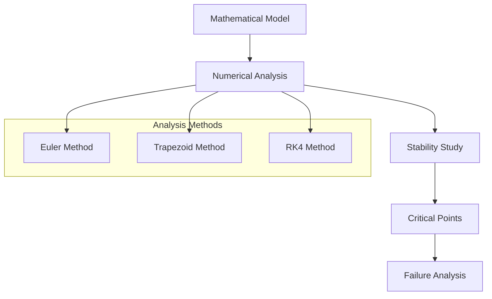

# The Tacoma Narrows Bridge: A Mathematical Analysis

## About The Project
A comprehensive analysis implementing the McKenna and Tuama (2001) mathematical model to study the catastrophic collapse of the 1940 Tacoma Narrows Bridge, focusing on torsional oscillations magnified by vertical forcing.

## Interactive Demo
Experience the bridge dynamics through our [interactive bridge animation](https://claude.site/artifacts/39a5c9ca-a6a3-4cc4-8715-2aec7fbe090f) demonstrating behavior under different wind conditions.

### Historical Context
The Tacoma Narrows Bridge, opened in July 1940, collapsed just four months later due to wind-induced aeroelastic flutter. This failure became a landmark case in structural engineering.

<div>
  
</div>

### Mathematical Analysis
<div>
  
</div>



## Technical Implementation

### Core Mathematical Framework
```python
def bridge_dynamics(t, y, params):
    """
    Coupled differential equations for bridge motion
    y = [vertical_displacement, angular_displacement, 
         vertical_velocity, angular_velocity]
    """
    w, delta, alpha = params
    dy = np.zeros_like(y)
    dy[0] = y[2]
    dy[1] = y[3]
    dy[2] = -w**2 * y[0] - delta * y[2] + alpha * y[1]
    dy[3] = -w**2 * y[1] - delta * y[3] - alpha * y[0]
    return dy
```

### Key Features & Results
- **Numerical Methods**: Euler's, Trapezoid, and RK4 methods
- **Wind Speed Analysis**:
  - Safe Operation: < 42 km/h
  - Warning Zone: 42-59 km/h
  - Critical Speed: 59.01 km/h (RK4)
  - Failure Point: > 62 km/h

### Stability Parameters
| Parameter | Original Value | Modified Value | Impact |
|-----------|---------------|----------------|---------|
| Damping Coefficient | 0.01 | 0.02 | Wind resistance: 59.01 → 105.62 km/h |
| Initial Angle | 0.01 rad | 0.02 rad | Linear response below critical speed |
| Wind Speed | 80 km/h | Various | Non-linear behavior above 59.01 km/h |

## Implementation Details

### Required Dependencies
```python
import numpy as np
import scipy.integrate
import matplotlib.pyplot as plt
from tqdm import tqdm
```

### Usage Instructions
```bash
pip install -r requirements.txt
python src/main.py --wind-speed 80 --method rk4 --damping 0.01
python src/visualize.py --results results.csv
```

## Citations

### Literature & Documentation
- McKenna & Tuama (2001): "Large Torsional Oscillations in Suspension Bridges"
- Timothy Sauer: "Numerical Analysis" (3rd Edition, 2017)
- [Tacoma Narrows Bridge Historical Documentation](https://en.wikipedia.org/wiki/Tacoma_Narrows_Bridge_(1940))

### Image Sources
- [Historical Newspaper Image](https://www.newspapers.com/image/289713513)
- [Opening Day Photo](https://en.wikipedia.org/wiki/Tacoma_Narrows_Bridge_(1940))

## License
MIT License - See LICENSE.md for details.
