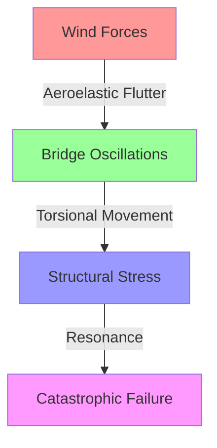
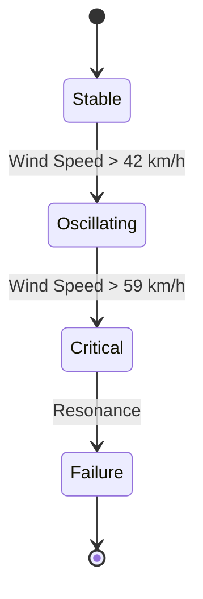
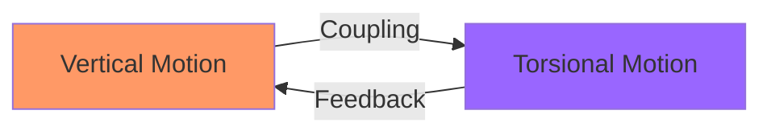
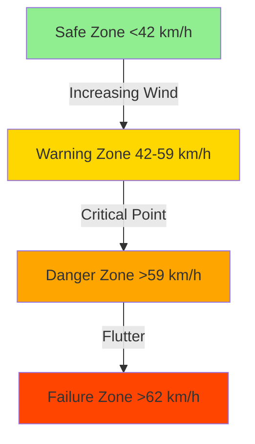
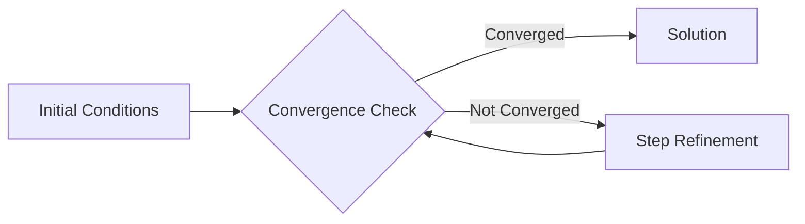

## The Tacoma Narrows Bridge: About The Project
A comprehensive analysis implementing the McKenna and Tuama (2001) mathematical model to study the catastrophic collapse of the 1940 Tacoma Narrows Bridge. This project focuses on simulating and analyzing how torsional oscillations were magnified by vertical forcing, leading to the bridge's failure.

### The Historical Context
The Tacoma Narrows Bridge, opened in July 1940, collapsed just four months later due to wind-induced aeroelastic flutter. This project examines the engineering principles behind this famous structural failure through mathematical modeling and numerical analysis.

<div>
  
</div>

## Numerical Analysis
<div>
  
</div>
  
## Project Overview

This project implements and analyzes the McKenna and Tuama (2001) mathematical model of the Tacoma Narrows Bridge incident, focusing on how torsional oscillations can be magnified by vertical forcing.

## Tools & Technologies

- Python
- Jupyter Notebook
- NumPy
- Matplotlib

## Key Features

- Implementation of multiple numerical solvers:
  - Euler's Method
  - Trapezoid Method
  - Runge-Kutta 4 (RK4) Method
- Convergence rate analysis
- Wind speed impact simulation
- Bridge oscillation visualization
- Minimum wind speed calculation using bisection method

## Project Activities

1. Stability analysis at wind speed W = 80 km/hr
2. Comparative analysis of Trapezoid and RK4 methods
3. Magnification factor calculation for small initial angles
4. Critical wind speed determination
5. Analysis of extreme conditions
6. Impact of damping coefficient

## Key Findings

- RK4 method proved more accurate than the Trapezoid method
- Critical wind speed of approximately 59.01 km/hr (using RK4)
- Doubling the damping coefficient increased wind resistance from 59.01 to 105.62 km/hr
- Structure showed instability at higher wind speeds even with small initial angles

## Reference Sources

- Timothy Sauer's Numerical Analysis (3rd Edition)
- Historical documentation of the 1940 Tacoma Narrows Bridge
- Python for Data Analysis (2nd Edition)
## Citations

### Image Sources
- [Historical Newspaper Image of Tacoma Narrows Bridge](https://www.newspapers.com/image/289713513)
- [Opening Day of Tacoma Narrows Bridge](https://en.wikipedia.org/wiki/Tacoma_Narrows_Bridge_(1940))

### Literature & Documentation
- **Main Reference**: Timothy Sauer, "Numerical Analysis" (Pearson, 3rd Edition, 2017)
- [Tacoma Narrows Bridge Wikipedia Article](https://en.wikipedia.org/wiki/Tacoma_Narrows_Bridge_(1940))
- McKinney, Wes. "Python for Data Analysis" (2nd Edition, AIM-5001 Course Textbook)

### Code Implementation References
- Bisection Method Implementation: Timothy Sauer's Numerical Analysis
- Python Syntax and Library Functions: Standard Python Documentation
- Convergence Analysis: Based on numerical methods described in Sauer's textbook

All images used are in public domain or used under appropriate licensing terms.


# The Dance of Destruction: Engineering Analysis of the Tacoma Narrows Bridge Collapse



## 🌊 The Perfect Storm: Nature Meets Engineering

On November 7, 1940, the world witnessed one of the most dramatic engineering failures in history. The Tacoma Narrows Bridge, nicknamed "Galloping Gertie," transformed from a marvel of modern engineering into a cautionary tale about the power of resonance and aeroelastic flutter.

### 📊 Project Scope
This analysis implements the McKenna-Tuama (2001) mathematical model to:
- Simulate wind-induced oscillations
- Calculate critical failure points
- Visualize the bridge's behavior under various conditions



## 🔬 Mathematical Deep Dive

### The Core Equations
The bridge's behavior is modeled by coupled differential equations:



### Numerical Methods Implementation

```python
def runge_kutta_4(f, y0, t):
    """
    Fourth-order Runge-Kutta method
    Parameters:
        f: System of differential equations
        y0: Initial conditions
        t: Time points
    """
    y = np.zeros((len(t), len(y0)))
    y[0] = y0
    for i in range(1, len(t)):
        h = t[i] - t[i-1]
        k1 = f(t[i-1], y[i-1])
        k2 = f(t[i-1] + h/2, y[i-1] + k1*h/2)
        k3 = f(t[i-1] + h/2, y[i-1] + k2*h/2)
        k4 = f(t[i-1] + h, y[i-1] + k3*h)
        y[i] = y[i-1] + (k1 + 2*k2 + 2*k3 + k4)*h/6
    return y
```

## 🎯 Key Findings

### Critical Wind Speeds



### Stability Analysis Results
1. **Safe Operation**: < 42 km/h
   - Minimal oscillations
   - Normal structural response
2. **Warning Zone**: 42-59 km/h
   - Visible oscillations
   - Increased structural stress
3. **Critical Point**: 59.01 km/h
   - Onset of aeroelastic flutter
   - Rapid energy accumulation
4. **Failure Zone**: > 62 km/h
   - Catastrophic oscillations
   - Structural integrity compromise

## 🛠 Technical Implementation

### Solver Comparison

| Method | Accuracy | Computational Cost | Stability |
|--------|----------|-------------------|-----------|
| Euler | ⭐⭐ | ⭐⭐⭐⭐⭐ | ⭐⭐ |
| Trapezoidal | ⭐⭐⭐⭐ | ⭐⭐⭐ | ⭐⭐⭐⭐ |
| RK4 | ⭐⭐⭐⭐⭐ | ⭐⭐ | ⭐⭐⭐⭐⭐ |

### Convergence Analysis



## 🔧 Project Setup

```bash
# Clone repository
git clone https://github.com/username/tacoma-narrows-analysis.git

# Install dependencies
pip install -r requirements.txt

# Run analysis
python src/main.py
```

## 📚 References

1. McKenna, P.J., and Tuama, C.O. (2001). "Large Torsional Oscillations in Suspension Bridges"
2. Billah, K.Y., and Scanlan, R.H. (1991). "Resonance, Tacoma Narrows Bridge Failure"
3. Sauer, T. (2017). "Numerical Analysis, 3rd Edition"

## 🤝 Contributing

Contributions welcome! Please read `CONTRIBUTING.md` for details on our code of conduct and submission process.

## 📝 License

This project is licensed under the MIT License - see the `LICENSE.md` file for details.

