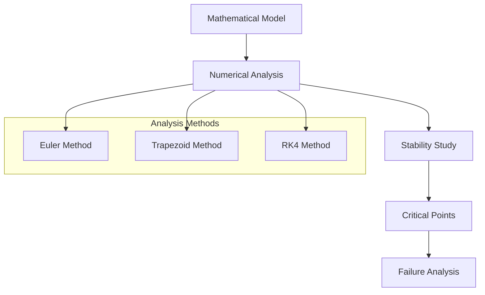
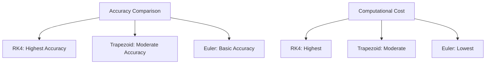

# The Tacoma Narrows Bridge: A Mathematical Analysis

A comprehensive analysis implementing the McKenna and Tuama (2001) mathematical model to study the catastrophic collapse of the 1940 Tacoma Narrows Bridge, focusing on torsional oscillations magnified by vertical forcing.

## Interactive Demo
Check out our [interactive bridge animation](https://claude.site/artifacts/39a5c9ca-a6a3-4cc4-8715-2aec7fbe090f) to visualize the bridge's behavior under different wind conditions.

### Historical Context
The Tacoma Narrows Bridge, opened in July 1940, collapsed just four months later due to wind-induced aeroelastic flutter. This project examines the engineering principles behind this famous structural failure through mathematical modeling and numerical analysis.

<div>
  
</div>

## Project Activities
1. Stability analysis at wind speed W = 80 km/hr
2. Comparative analysis of Trapezoid and RK4 methods
3. Magnification factor calculation for small initial angles
4. Critical wind speed determination
5. Analysis of extreme conditions
6. Impact of damping coefficient

<div>
  
</div>

## Tools & Technologies
- Python
- Jupyter Notebook
- NumPy
- Matplotlib

## Technical Implementation

### Mathematical Model Flow


### Core Mathematical Framework
```python
def bridge_dynamics(t, y, params):
    """
    Coupled differential equations for bridge motion
    y = [vertical_displacement, angular_displacement, 
         vertical_velocity, angular_velocity]
    """
    w, delta, alpha = params
    dy = np.zeros_like(y)
    dy[0] = y[2]
    dy[1] = y[3]
    dy[2] = -w**2 * y[0] - delta * y[2] + alpha * y[1]
    dy[3] = -w**2 * y[1] - delta * y[3] - alpha * y[0]
    return dy
```

### Numerical Methods
1. **Implemented Solvers**
   - Euler's Method
   - Trapezoid Method (2nd order)
   - Runge-Kutta 4 (4th order)

2. **Convergence Analysis**
   ```mermaid
   graph LR
       A[Initial State] --> B[RK4 Solver]
       B --> C{Convergence Check}
       C -->|Yes| D[Solution]
       C -->|No| E[Refine Step]
       E --> B
   ```

## Key Findings

### Wind Speed Analysis
- **Safe Operation**: < 42 km/h
- **Warning Zone**: 42-59 km/h
- **Critical Speed**: 59.01 km/h (RK4 calculation)
- **Failure Point**: > 62 km/h

### Stability Parameters
| Parameter | Original Value | Modified Value | Impact |
|-----------|---------------|----------------|---------|
| Damping Coefficient | 0.01 | 0.02 | Wind resistance: 59.01 → 105.62 km/h |
| Initial Angle | 0.01 rad | 0.02 rad | Linear response below critical speed |
| Wind Speed | 80 km/h | Various | Non-linear behavior above 59.01 km/h |

### Solver Comparison


## Implementation Details

### Required Dependencies
```python
import numpy as np
import scipy.integrate
import matplotlib.pyplot as plt
from tqdm import tqdm

def runge_kutta_4(f, y0, t, params):
    y = np.zeros((len(t), len(y0)))
    y[0] = y0
    h = t[1] - t[0]
    
    for i in range(1, len(t)):
        k1 = f(t[i-1], y[i-1], params)
        k2 = f(t[i-1] + h/2, y[i-1] + k1*h/2, params)
        k3 = f(t[i-1] + h/2, y[i-1] + k2*h/2, params)
        k4 = f(t[i-1] + h, y[i-1] + k3*h, params)
        y[i] = y[i-1] + (k1 + 2*k2 + 2*k3 + k4)*h/6
    return y
```

### Usage Instructions
```bash
pip install -r requirements.txt
python src/main.py --wind-speed 80 --method rk4 --damping 0.01
python src/visualize.py --results results.csv
```

## Citations

### Literature & Documentation
- McKenna & Tuama (2001): "Large Torsional Oscillations in Suspension Bridges"
- Timothy Sauer: "Numerical Analysis" (3rd Edition, 2017)
- Historical documentation of the 1940 Tacoma Narrows Bridge
- Python for Data Analysis (2nd Edition)

### Image Sources
- [Historical Newspaper Image](https://www.newspapers.com/image/289713513)
- [Opening Day Photo](https://en.wikipedia.org/wiki/Tacoma_Narrows_Bridge_(1940))

### Code Implementation References
- Bisection Method: Timothy Sauer's Numerical Analysis
- Python Documentation & Standard Library
- Convergence Analysis: Sauer's textbook methods

## License
MIT License - See LICENSE.md for details.
